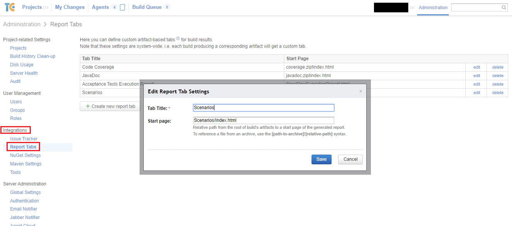

  ```csharp 
  <?xml version="1.0" encoding="utf-8" ?> 
  <configuration> 
    <startup> 
      <supportedRuntime version="v4.0.30319" /> 
    </startup> 
  </configuration>
  ```
3. Open the configuration of your build project. Add a new build step. 
In Runner Type dropdown pick "Command Line", in Run dropdown pick "Custom script".


4. Specify a script to run:
  ```bat 
  :: execute tests using NUnit 
  "path_to_nunit-console.exe" path_to_project_with_specflow_scenarios /xml:xml_report_output_path 
  :: generate scenarios definition and execution report using Pickles 
  "path_to_Pickles.exe" --feature-directory=directory_containing_all_features --output-directory=Scenarios --test-results-format=nunit --link-results-file= xml_report_output_path  --documentation-format=Dhtml
  ```
**Note**: The paths are relative with regard to the solution file.
  ```bat 
  :: Sample script:
  :: execute tests using NUnit 
  "Tests\OnlineShopping.Scenarios.Tests\TestsReport\Runners\NUnit 2.6.2\nunit-console.exe" Tests\OnlineShopping.Scenarios.Tests\OnlineShopping.Scenarios.Tests.csproj /xml:TestsResult.xml 
  :: generate scenarios definition and execution report using Pickles 
  "Tests\OnlineShopping.Scenarios.Tests\TestsReport\Runners\Pickles\Pickles.exe" --feature-directory=Tests\OnlineShopping.Scenarios.Tests --output-directory=Scenarios --test-results-format=nunit --link-results-file=TestsResult.xml --documentation-format=Dhtml
  ```

5. Configure a new report tab:
  *	Open TeamCity web app. Go to Administration -> Integrations -> Report tabs.
  *	Click "Create new report tab" button.
  *	Specify the name of the new tab and location of the start page in your rep.


  
**Note**: The path of the start page is relative to the Teamcity artifacts directory.

**Note**: To configure new Report Tabs you need to be a TeamCity administrator.
  


